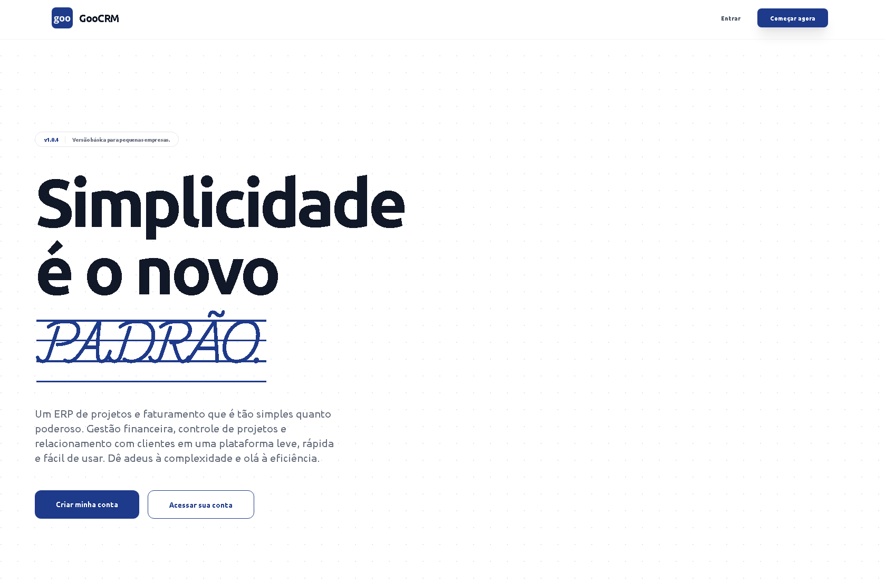

# Goo CRM - Sistema de Gestão Simples e Descomplicada (ERP)


O **Goo CRM** é um ecossistema minimalista e profissional projetado para a gestão eficiente de faturamento, clientes e projetos. Desenvolvido com foco em UX/UI limpa, o sistema oferece uma visão clara da saúde financeira e do progresso operacional de agências e prestadores de serviço.



---

## 🚀 Funcionalidades Principais

### 📊 Dashboard Inteligente
* **KPIs em Tempo Real:** Monitoramento de faturamento recebido, valores a receber e taxa de inadimplência.
* **Filtros Dinâmicos:** Visualização de resultados por períodos (7 dias, 30 dias, 6 meses e 1 ano).
* **Navegação Rápida:** Atalhos para as últimas movimentações financeiras e novos clientes.

### 👥 Gestão de Clientes
* Cadastro completo de Clientes e Leads.
* Controle de status dinâmico (Ativo, Inativo, Lead).
* Sistema de segurança com modal de confirmação via digitação de nome.

### 📂 Gestão de Projetos
* Acompanhamento de prazos e orçamentos.
* Vinculação direta com faturamento.
* Recurso de arquivamento para manutenção histórica.

### 💰 Fluxo Financeiro
* Gerenciamento de faturas com geração de PDF.
* Controle de status automático (Pendente, Pago, Atrasado).
* Segurança reforçada para estornos financeiros.

---

## 🛠️ Stack Técnica

* **Framework:** Laravel 11 (Blade Traditional)
* **Frontend:** Tailwind CSS (Minimalist UI)
* **Interatividade:** Alpine.js
* **Banco de Dados:** MySQL com UUID em todas as estruturas.
* **Autenticação:** Laravel Breeze.
* **Gerenciamento de Assets:** Vite.

---

## 📦 Instalação e Configuração

Siga os passos abaixo para configurar o ambiente de desenvolvimento local:

1. **Clonar o Repositório:**
   ```bash
   git clone git@github.com:LeonardoFirme/goo-crm.git
   cd goo-crm
    ```

2.  **Instalar Dependências PHP:**

    ```bash
    composer install
    ```

3.  **Instalar Dependências de Assets:**

    ```bash
    npm install && npm run dev
    ```

4.  **Configurar Ambiente:**

    ```bash
    cp .env.example .env
    php artisan key:generate
    ```

5.  **Configurar Banco de Dados:**
    No seu arquivo `.env`, ajuste as credenciais do MySQL e execute:

    ```bash
    php artisan migrate --seed
    ```

6.  **Iniciar Servidor:**

    ```bash
    php artisan serve
    ```

7.  **Iniciar NPM para o laytout:**

    ```bash
    npm run dev
    ```

-----

## 🛡️ Segurança e Padrões de Layout

Este projeto segue diretrizes rígidas de design e desenvolvimento:

  * **Minimalismo Profissional:** UX focada no dado, sem distrações.
  * **Proibição Estética:** Nenhuma utilização de classes `italic` ou `uppercase` no layout.
  * **Persistência:** Uso obrigatório de UUID para integridade de dados e segurança em URLs.
  * **Responsividade:** Interface adaptativa para dispositivos móveis via Sidebar inteligente.

-----

## 📄 Licença

Este projeto está sob a licença [MIT](https://github.com/LeonardoFirme/goo-crm?tab=MIT-1-ov-file).

-----

**Autor e Desenvolvedor do projeto:**

[](https://github.com/LeonardoFirme)